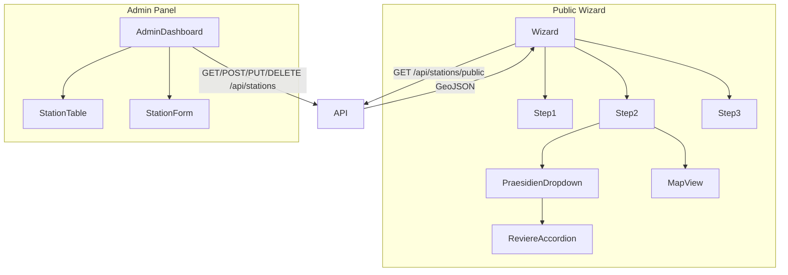

# Architektur-Blueprint (SOLL-Zustand)

## 1. Tech Stack (empfohlen)
- **Framework:** React (mit TypeScript)
- **State Management:** Zustand (global), React Context (UI-spezifisch)
- **Routing:** React Router v6
- **Styling:** TailwindCSS
- **API Layer:** fetch/axios, React Query für Caching und asynchrone Daten
- **Testing:** Jest, React Testing Library, Cypress (E2E)
- **Build Tool:** Vite

---

## 2. Datenstrategie: Statisch + Dynamisch + Admin-CRM
```ts
// types.ts
interface Station {
  id: string;
  name: string;
  type: "praesidium" | "revier";
  parentId?: string; // Für Reviere: ID des zugehörigen Präsidiums
  city: string;
  address: string;
  coordinates: [number, number];
  telefon: string;
  notdienst24h: boolean;
  isActive: boolean;
  lastModified: Date;
}
interface DataSource {
  baseGeometry: GeoJSON.FeatureCollection; // Statisch
  stations: Station[];                     // Dynamisch
}
```

---

## 3. Datenfluss & API-Design
```plaintext
┌─────────────┐       ┌─────────────┐       ┌─────────────┐
│ Öffentlicher│       │   Backend   │       │  Admin-Panel│
│  Wizard     │◄─────►│  (API)      │◄─────►│ (CRUD)      │
└─────────────┘       └─────────────┘       └─────────────┘
       │                      │                      │
       │ GET /api/stations    │ GET/POST/PUT/DELETE  │
       │ (read-only)          │ /api/stations/:id    │
       └─────────────────────┘ └─────────────────────┘
```
**API-Endpunkte:**
- `GET /api/stations/public` – Öffentlicher Wizard (read-only, gecached)
- `GET /api/stations/admin` – Admin-Panel (vollständige Daten)
- `POST/PUT/DELETE /api/stations/:id` – CRUD für Admin
- `GET /api/stations/geometry` – Statische Geodaten

---

## 4. State Management: Dual Stores
```ts
// src/lib/store/public-store.ts
interface PublicStore {
  baseGeometry: GeoJSON.FeatureCollection;
  stations: Station[]; // Read-only
  selectedStations: string[]; // IDs der ausgewählten Stationen
  wizardStep: 1 | 2 | 3;
}
// src/lib/store/admin-store.ts
interface AdminStore {
  stations: Station[];
  isLoading: boolean;
  selectedStation?: Station;
  filter: {
    city: string;
    type: "alle" | "praesidium" | "revier";
  };
}
```

---

## 5. Komponentenstruktur
```plaintext
src/
  components/
    wizard/
      Step1AddressInput.tsx
      Step2PraesidienReviere.tsx   // Präsidien/Reviere-Hierarchie
      Step3Export.tsx
      MapView.tsx
    admin/
      StationTable.tsx             // Filter, Suche, CRUD
      StationForm.tsx              // Bearbeiten/Anlegen
      AdminHeader.tsx
  lib/
    store/
      public-store.ts
      admin-store.ts
    api/
      stations-api.ts
  pages/
    wizard.tsx
    admin/
      index.tsx
      login.tsx
```

---

## 6. Komponenten- und Datenfluss-Diagramm


---

## 7. Security & Auth
- **JWT-Authentifizierung** für Admin-Panel
- **Middleware** schützt alle Admin-API-Routen
- **Session-Management:** Token im httpOnly-Cookie (Production)

---

## 8. Performance & Caching
- **Public:** React Query für Caching, Lazy-Load Map-Komponente
- **Admin:** Optimistische Updates, Debounce für Filter/Suche

---

## 9. Testing
- **Unit-Tests:** Stores, Filterlogik, Komponenten
- **E2E-Tests:** Wizard-Flow, Admin-CRUD

---

## 10. Roadmap (Nächste Schritte)
1. **API-Design finalisieren** (inkl. Auth, Datenmodell)
2. **publicStore/adminStore implementieren**
3. **CRUD-Komponenten für Admin bauen**
4. **Wizard-Komponenten an neue Datenstruktur anpassen**
5. **Testing & Security**

---

**Fazit:**
Mit dieser Architektur bist du maximal flexibel, skalierbar und zukunftssicher. Die Trennung von statischen und dynamischen Daten, getrennte Stores und ein klarer API-Layer ermöglichen sowohl schnelle User Experience als auch komfortable Admin-Verwaltung. 