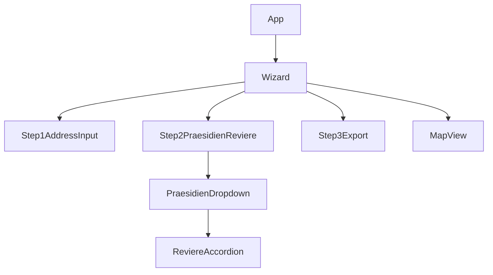
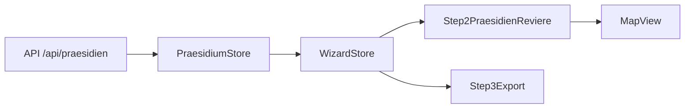
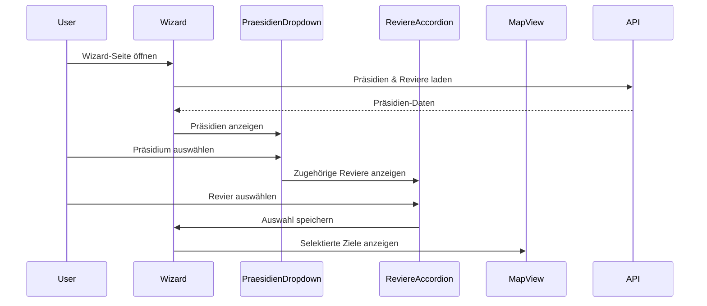

# Architektur-Übersicht

## 1. Technische Struktur

### 1.1 Tech Stack Änderungen
- **Framework:** React (aktuellste Version, mit TypeScript)
- **State Management:** Zustand für globale Stores, Context API für UI-spezifische Zustände
- **Routing:** React Router v6 (file-based Routing möglich)
- **Styling:** TailwindCSS (Utility-first), ggf. Umstieg von CSS Modules
- **API Layer:** Nutzung von fetch/axios, Einführung von React Query für asynchrone Daten und Caching
- **Testing:** Jest, React Testing Library
- **Build Tool:** Vite

### 1.2 Verzeichnisstruktur & Naming
```plaintext
src/
  components/
    wizard/
      Step1AddressInput.tsx
      Step2PraesidienReviere.tsx
      Step3Export.tsx
      PraesidienDropdown.tsx
      ReviereAccordion.tsx
    map/
      MapView.tsx
      MapControls.tsx
  lib/
    store/
      praesidium-store.ts
      wizard-store.ts
    api/
      praesidium-api.ts
  pages/
    index.tsx
    wizard.tsx
  assets/
  styles/
```
- **Naming:** Deutsch für Domänenobjekte (Praesidium, Revier), Englisch für technische Begriffe (store, api, component)

### 1.3 Datenfluss
- Präsidien und Reviere werden beim Laden der Wizard-Seite per API geladen (`/api/praesidien`).
- Die Zuordnung erfolgt im Store als verschachtelte Struktur:
  ```ts
  interface Praesidium {
    id: string;
    name: string;
    reviere: Revier[];
  }
  interface Revier {
    id: string;
    name: string;
    praesidiumId: string;
  }
  ```
- Auswahl/Filterung erfolgt im lokalen Wizard-Store.
- Die Map-Komponente erhält die selektierten Ziele als Props/State.

---

## 2. Architektur-Diagramme

### 2.1 Komponenten-Hierarchie


### 2.2 State Management & Datenfluss


### 2.3 Ablaufdiagramm Wizard-Interaktion


---

## 3. Konkrete Dateien/Code

### 3.1 Hauptkonfiguration
- `package.json`, `vite.config.ts`, `tsconfig.json` – Standardkonfiguration, ggf. mit Aliasen für neue Folderstruktur

### 3.2 Store/State
- `src/lib/store/praesidium-store.ts` – Lädt und verwaltet Präsidien/Reviere
- `src/lib/store/wizard-store.ts` – Wizard-spezifischer UI-State (z.B. ausgewählte Ziele)

### 3.3 Routing
- `src/pages/wizard.tsx` – Einstiegspunkt für den Wizard
- Navigation über React Router v6

### 3.4 Key Components
- `src/components/wizard/Step2PraesidienReviere.tsx` – Präsidien-Dropdown, Accordion für Reviere
- `src/components/wizard/PraesidienDropdown.tsx` – Dropdown für Präsidien
- `src/components/wizard/ReviereAccordion.tsx` – Accordion für Reviere
- `src/components/map/MapView.tsx` – Kartenintegration

---

## 4. Bewertungskriterien

### 4.1 Performance
- Ziel: Schnelle Ladezeiten (<1s für Initialdaten), Lazy Loading für Map-Komponenten
- Caching der API-Responses mit React Query

### 4.2 Skalierbarkeit
- Zukünftige Features: Mehrere Bundesländer, Filter nach Revier-Typ, Exportfunktionen, Mehrsprachigkeit

### 4.3 Team-Kontext
- Teamgröße: 2–5 Entwickler
- Expertise: React, TypeScript, API-Design, UI/UX

---

# Beispiel-Datenstruktur für Präsidien und Reviere

```ts
// Beispiel: API-Response /api/praesidien
[
  {
    "id": "stuttgart",
    "name": "Polizeipräsidium Stuttgart",
    "reviere": [
      { "id": "stuttgart-mitte", "name": "Polizeirevier Stuttgart-Mitte" },
      { "id": "stuttgart-nord", "name": "Polizeirevier Stuttgart-Nord" }
    ]
  },
  {
    "id": "karlsruhe",
    "name": "Polizeipräsidium Karlsruhe",
    "reviere": [
      { "id": "karlsruhe-mitte", "name": "Polizeirevier Karlsruhe-Mitte" }
    ]
  }
]
```

---

# Hinweise zur Weiterentwicklung
- Die Komponentenstruktur ist modular und kann leicht erweitert werden.
- Die Datenstruktur ist so gewählt, dass neue Präsidien/Reviere einfach ergänzt werden können.
- Die Trennung von UI-State (WizardStore) und Daten (PraesidiumStore) sorgt für Übersichtlichkeit und Skalierbarkeit.
- Die Diagramme können mit Mermaid live in VS Code oder GitHub angezeigt werden. 