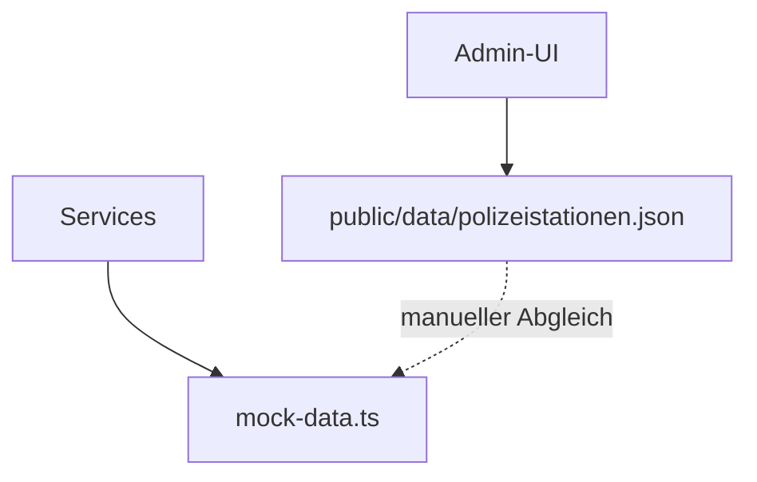
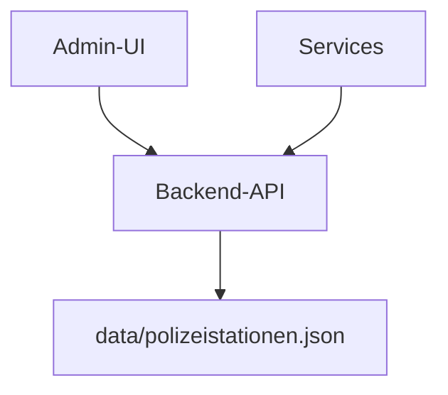

# 📋 Einleitung: Zentrale Polizeistations-Verwaltung

## 🚨 Problemstellung

Aktuell gibt es **zwei verschiedene Datenquellen** für Polizeistationen:

1. **`src/services/api/mock-data.ts`** – TypeScript-Datei mit allen aktuellen Daten
2. **`public/data/polizeistationen.json`** – JSON-Datei, die vom Admin-Bereich verwendet wird

**Das führt zu:**
- ❌ Inkonsistenten Daten zwischen Admin-UI und anderen Bereichen
- ❌ Manueller Abgleich nötig bei Änderungen
- ❌ Änderungen im Admin-Bereich werden nicht in die Services übernommen
- ❌ Keine zentrale Datenhaltung

---

## 🚀 Lösung: Backend-API mit zentraler Datenhaltung

### Was wir erreichen wollen:

- ✅ **Eine zentrale Datenquelle** für alle Polizeistationen
- ✅ **Automatische Synchronisation** zwischen Admin-UI und allen Services
- ✅ **Änderungen im Admin-Bereich** werden sofort für alle sichtbar
- ✅ **Skalierbare Architektur** für spätere Erweiterungen

### Wie es funktioniert:

1. **Backend-API (Node.js/Express)** verwaltet alle Daten in einer JSON-Datei
2. **Admin-UI** sendet Änderungen an die API
3. **Alle Services** holen Daten von der API
4. **Keine manuellen Abgleiche** mehr nötig

---

## 🏗️ Aktuelle vs. Ziel-Architektur

### Aktuell:

### Ziel:

---

## 🔧 Technologie-Stack

- **Backend:** Node.js + Express
- **Datenhaltung:** JSON-Datei (später erweiterbar auf Datenbank)
- **Frontend:** Bestehende React-Anwendung
- **API:** RESTful Endpoints für CRUD-Operationen

---

## 📋 Nächste Schritte

1. **Task-Plan durchgehen** (siehe separate Datei)
2. **Backend-API aufsetzen**
3. **Frontend anpassen**
4. **Services umstellen**
5. **Testen und optimieren**

---

## 🎯 Vorteile der neuen Architektur

### Für Entwickler:
- **Weniger Wartungsaufwand** - keine manuellen Abgleiche mehr
- **Konsistente Daten** - alle Bereiche nutzen die gleiche Datenquelle
- **Bessere Skalierbarkeit** - einfach erweiterbar für neue Features

### Für Benutzer:
- **Sofortige Aktualisierung** - Änderungen sind sofort überall sichtbar
- **Zuverlässige Daten** - keine Inkonsistenzen zwischen verschiedenen Bereichen
- **Bessere Performance** - zentrale Datenhaltung ermöglicht Optimierungen

---

## 🔄 Migration-Plan

### Phase 1: Backend aufsetzen
- Node.js/Express API erstellen
- JSON-Datei als Datenspeicher einrichten
- CRUD-Endpoints implementieren

### Phase 2: Frontend anpassen
- Admin-UI auf API umstellen
- Services auf API umstellen
- Fehlerbehandlung verbessern

### Phase 3: Optimierung
- Performance optimieren
- Sicherheit verbessern
- Monitoring einrichten

---

**Bereit für die Umsetzung? Dann schauen wir uns den detaillierten Task-Plan an!** 